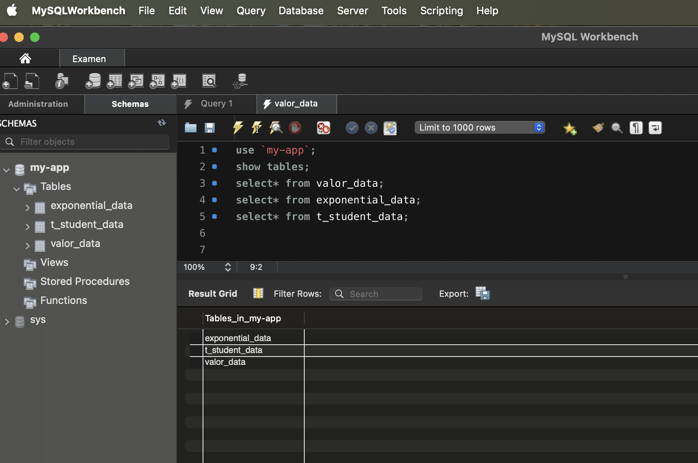

# Examen Concurrente

[Repositorio](https://github.com/Examenconcurrente/JavaConEx.git)

Proyecto realizado por Jose Daniel Martín y Hugo Sanchez.

## JavaConEx

**JavaConEx** es una aplicación que implementa una arquitectura concurrente utilizando **Java Spring Boot** y **Server-Sent Events (SSE)** para transmitir datos en tiempo real. La aplicación permite cargar datos desde archivos CSV a una base de datos, utilizando hilos para procesar la información de manera eficiente y asegurando la concurrencia mediante **semáforos** y **CountDownLatch**. Además, ofrece una interfaz web para interactuar con estos datos, los cuales se visualizan en gráficos dinámicos.

Los datos cargados desde la base de datos también se transmiten en tiempo real a través de hilos, que los envían a la interfaz utilizando eventos **SSE**, permitiendo una visualización fluida y actualizada de los valores en la página web.

Este proyecto está diseñado para gestionar datos de diferentes distribuciones estadísticas, como los **datos normales**, **exponenciales** y de **T-Student**.

## Flujo de Funcionamiento de la Aplicación

1. **Inicio de la Aplicación**:
   - La aplicación se inicia ejecutando el método `main` en la clase `JavaConExApplication`.
   - Spring Boot se encarga de inicializar el contexto de la aplicación y de inyectar las dependencias necesarias.

2. **Carga de Datos CSV**:
   - Después de la inicialización, el método `init` anotado con `@PostConstruct` se ejecuta automáticamente.
   - Este método llama a `loadCSVService` para cargar datos desde varios archivos CSV (`valores_normales.csv`, `valores_t_student.csv`, `valores_exponenciales.csv`) a la base de datos.

3. **Apertura del Navegador**:
   - Una vez que los datos se han cargado, el método `openBrowser` se llama para abrir automáticamente la URL `http://localhost:8080/menu.html` en el navegador predeterminado del sistema operativo.

4. **Interacción con la Base de Datos**:
   - La aplicación proporciona varios servicios y controladores para interactuar con los datos cargados.
   - Por ejemplo, `ValorDataController` expone endpoints REST para obtener y guardar datos de la tabla `valor_data`.
   - Similarmente, `TStudentDataService` y `ExponentialDataService` manejan la lógica de negocio para las tablas `t_student_data` y `exponential_data`, respectivamente.

5. **Interfaz Web**:

    La interfaz web permite a los usuarios interactuar con los datos cargados en la base de datos.

   - La interfaz utiliza **D3.js** para visualizar los datos en gráficos dinámicos.
   - Los datos se transmiten en tiempo real desde el servidor al cliente utilizando **Server-Sent Events (SSE)**.
   - El servidor utiliza `SseEmitter` para enviar datos concurrentemente a través de hilos.
   - La interfaz web se actualiza automáticamente con los datos recibidos, proporcionando una experiencia interactiva y en tiempo real.

## Clases

### `DataController`

Este controlador maneja las solicitudes HTTP para transmitir datos de manera concurrente usando **Server-Sent Events (SSE)**. Contiene tres rutas:

- **`/hilos-concurrentes`**: Envía los datos de la entidad `ValorData` en tiempo real, utilizando el método `streamCSVData()` del servicio `LoadCSVService`.
- **`/exponential/stream`**: Envía datos exponenciales en tiempo real mediante el método `streamExponentialData()`.
- **`/tstudent/stream`**: Envía datos de T-Student en tiempo real utilizando el método `streamTStudentData()`.

Cada una de estas rutas utiliza un `ExecutorService` para manejar los datos de manera concurrente y garantizar que el servidor no se bloquee mientras envía los datos.

### `LoadCSVService`

Este servicio es responsable de cargar datos desde archivos CSV a la base de datos y transmitir esos datos en tiempo real mediante SSE. Utiliza un `ExecutorService` para manejar la concurrencia y un semáforo (`Semaphore`) para asegurar que solo un hilo a la vez acceda a recursos compartidos como la base de datos.

- **`loadCSVToDatabase`**, **`loadExponentialCSVToDatabase`**, y **`loadTStudentCSVToDatabase`**: Cargan datos desde archivos CSV a las tablas correspondientes en la base de datos.
- **`streamCSVData`**, **`streamExponentialData`**, y **`streamTStudentData`**: Transmiten los datos de las tablas `ValorData`, `ExponentialData`, y `TStudentData` en tiempo real utilizando SSE, asegurándose de que los datos se envíen de manera concurrente y no bloqueen el servidor.

### `ValorData`

Es la entidad que representa la tabla `valor_data` en la base de datos. Contiene dos campos:
- `id`: El identificador único para cada registro.
- `value`: El valor correspondiente al registro.

### `ValorDataController`

Este controlador ofrece dos rutas para interactuar con los datos almacenados en `valor_data`:

- **GET `/valores`**: Recupera todos los valores almacenados en la tabla.
- **POST `/valores`**: Guarda un nuevo valor en la base de datos.

### `ValorDataService`

Proporciona la lógica de negocio para manejar los datos de la entidad `ValorData`. Incluye métodos para:

- Recuperar todos los valores con `getAllValores()`.
- Guardar un nuevo valor en la base de datos con `saveValor()`.

### `ValorRepository`

Es una interfaz que extiende `JpaRepository`, proporcionando métodos para acceder y modificar los datos de `ValorData`. También incluye un método personalizado:

- **`truncateTable()`**: Trunca la tabla `valor_data`, eliminando todos los registros.

## Interfaz Web

La interfaz web permite a los usuarios interactuar con los datos cargados en la base de datos. Está compuesta por cuatro archivos HTML principales:

#### `menu.html`

**Descripción:**
Este archivo actúa como el menú principal de la aplicación, proporcionando enlaces a las diferentes distribuciones estadísticas (Normal, Exponencial y T-Student) mediante iframes.

**Funcionamiento:**
- Contiene tres secciones, cada una con un iframe que carga una página HTML específica para cada distribución.
- Permite a los usuarios navegar entre las diferentes visualizaciones de datos sin salir de la página principal.

#### `menu_normal.html`

**Descripción:**
Este archivo muestra la visualización de la distribución normal utilizando un tablero de Galton.

**Funcionamiento:**
- Utiliza D3.js para representar visualmente las bolas y los pines en el tablero.
- Las bolas caen y se distribuyen según la distribución normal.
- Los datos se transmiten en tiempo real desde el servidor utilizando Server-Sent Events (SSE).
- Un botón de inicio permite comenzar la simulación de la caída de las bolas.

#### `menu_exponential.html`

**Descripción:**
Este archivo muestra la visualización de la distribución exponencial utilizando un tablero de Galton.

**Funcionamiento:**
- Similar a `menu_normal.html`, utiliza D3.js para la representación visual.
- Las bolas caen y se distribuyen según la distribución exponencial.
- Los datos se transmiten en tiempo real desde el servidor utilizando SSE.
- Un botón de inicio permite comenzar la simulación de la caída de las bolas.

#### `menu_tstudent.html`

**Descripción:**
Este archivo muestra la visualización de la distribución T-Student utilizando un tablero de Galton.

**Funcionamiento:**
- Utiliza D3.js para representar visualmente las bolas y los pines en el tablero.
- Las bolas caen y se distribuyen según la distribución T-Student.
- Los datos se transmiten en tiempo real desde el servidor utilizando SSE.
- Un botón de inicio permite comenzar la simulación de la caída de las bolas.

## Problemas y Soluciones

### Problema 1: Sincronización de la representación de las bolas

**Descripción:**
La velocidad de representación de las bolas está sujeta a la velocidad de la gravedad para que se vean más naturales. Inicialmente, agregamos el `sleep` en los hilos, pero tras pruebas vimos que los hilos se generaban demasiado perfectos, leían todos los ID por orden y todo era demasiado perfecto.

**Solución:**
Decidimos agregar, en vez del `sleep` en los hilos, el `setTimeout` en la actualización de la información para que diese la sensación de que se genera a la vez de las bolas. Esto no es posible porque la información que sacan los hilos es casi instantánea y las bolas, por la gravedad mencionada, tardan en caer.

### Problema 2: Transmisión de datos de la base de datos al front

**Descripción:**
En un inicio, la transmisión de datos de la base de datos al front se realizaba por medio de hilos. Guardábamos esa información en un `Map` de una variable para llamarlo a nuestro HTML, pero este cargaba de golpe y, por consiguiente, carecía de concurrencia.

**Solución:**
Investigando, encontramos `SseEmitter` para poder transmitir los datos en tiempo real sin necesidad de guardarlos en una variable.

### Problema 3: Creación del menú exponencial por la disposición de las bolas

**Descripción:**
La disposición de las bolas en el menú exponencial no era la esperada debido a la probabilidad inicial de 0.5, lo que resultaba en una distribución no adecuada para la visualización.

**Solución:**
Se cambió la probabilidad de 0.5 a 0.73 para ajustar la disposición de las bolas y obtener una distribución más representativa de la exponencial.

### Problema 4: Coger los datos de los hilos y no de la base de datos

**Descripción:**
Inicialmente, los datos se obtenían directamente de la base de datos, lo que no aprovechaba la concurrencia y la capacidad de los hilos para procesar datos en tiempo real.

**Solución:**
Se revisaron y ajustaron los métodos para que los datos se obtuvieran directamente de los hilos en lugar de la base de datos, mejorando así la eficiencia y la concurrencia en la transmisión de datos.

### Problema 5: Truncado de la base de datos

**Descripción:**
Cuando se truncaba la base de datos y luego se leían los datos, se seguían cargando IDs adicionales, lo que resultaba en una discrepancia entre los IDs reales en la base de datos y los IDs cargados.

**Solución:**
Se resolvió asegurándose de que la base de datos se lean primero, luego se trunque y finalmente se carguen los datos. Esto garantiza que no haya IDs adicionales cargados después del truncado.

## Screenshots

### Tablas Base de Datos

### Tabla Normal

### Módulo Acción

### Módulo Resultados

